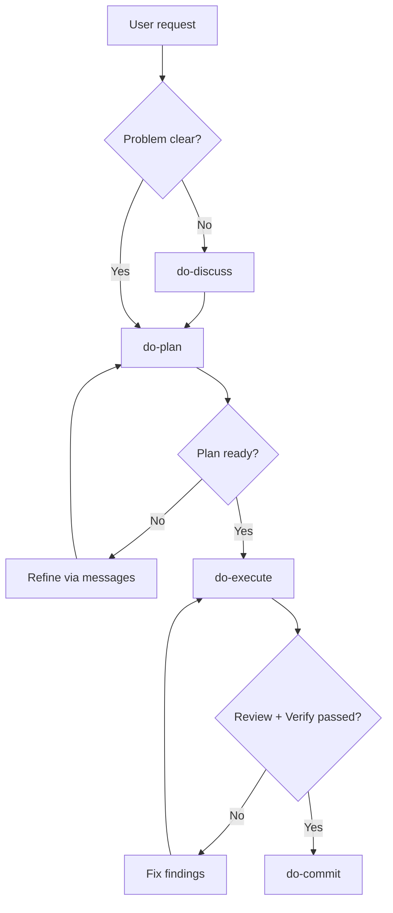

# Spine

> **Same skills, same workflow — every developer, every tool.**

AI coding setup for Cursor, Claude Code, and Codex. One set of skills, agents, and guardrails that works everywhere.

## Contents

- [Quick Start](#quick-start)
- [Typical Flow](#typical-flow)
- [Skills and Agents](#skills-and-agents)
- [Claude Code Plugin](#claude-code-plugin)
- [Tips](#tips)
- [Design Principles](#design-principles)
- [Further Reading](#further-reading)

## Quick Start

> **If it's worth changing, it's worth planning.**

Installs guardrails, skills, agents, and hooks for all detected tools (Cursor, Claude Code, Codex):

```sh
curl -fsSL https://raw.githubusercontent.com/kenoxa/spine/main/install.sh | bash
```

The installer auto-detects which tools you have (`~/.cursor/`, `~/.claude/`, `~/.codex/`) and installs to all of them. For Claude Code, it also installs the [Spine plugin](#claude-code-plugin) (hooks and `use-agent-teams` skill).

<details>
<summary>Inspect before running</summary>

```sh
curl -fsSL https://raw.githubusercontent.com/kenoxa/spine/main/install.sh -o install.sh
less install.sh
bash install.sh
```

</details>

<details>
<summary>Local checkout (recommended for contributors)</summary>

Clone the repo for editing, testing, and iterating on skills before syncing:

```sh
git clone https://github.com/kenoxa/spine.git
cd spine
./install.sh
```

</details>

<details>
<summary>Install individual skills</summary>

Install specific skills without the full setup:

```sh
npx skills add kenoxa/spine -s do-plan -a '*' -g -y
npx skills add kenoxa/spine -s do-review -a '*' -g -y
```

</details>

<details>
<summary>Manual install</summary>

Set up the central directory and reference it from each tool:

```sh
# 1. Copy guardrails and agents to the central directory
mkdir -p ~/.config/spine/agents
cp SPINE.md ~/.config/spine/SPINE.md
cp agents/*.md ~/.config/spine/agents/

# 2. Reference from each tool's root file (add your own instructions below the @ line)
echo '@~/.config/spine/SPINE.md' > ~/.cursor/AGENTS.md
echo '@~/.config/spine/SPINE.md' > ~/.claude/CLAUDE.md
echo '@~/.config/spine/SPINE.md' > ~/.codex/AGENTS.md

# 3. Symlink agents (or copy with: cp ~/.config/spine/agents/*.md ~/.<tool>/agents/)
for agent in ~/.config/spine/agents/*.md; do
  ln -sf "../../.config/spine/agents/$(basename "$agent")" ~/.cursor/agents/
  ln -sf "../../.config/spine/agents/$(basename "$agent")" ~/.claude/agents/
  ln -sf "../../.config/spine/agents/$(basename "$agent")" ~/.codex/agents/
done
```

Skills are installed separately via `npx skills add` (see above).

**Claude Code plugin:** Install the Spine plugin for hooks and the `use-agent-teams` skill:

```sh
claude plugin marketplace add kenoxa/spine
claude plugin install spine@kenoxa
```

If your Claude Code CLI doesn't support plugins, install the AGENTS.md hook manually:

```sh
mkdir -p ~/.claude/hooks/
cp claude/hooks/inject-agents-md.sh ~/.claude/hooks/
```

Add to `~/.claude/settings.json`:

```json
{
  "hooks": {
    "SessionStart": [{
      "hooks": [{ "type": "command", "command": "~/.claude/hooks/inject-agents-md.sh" }]
    }]
  }
}
```

</details>

## Typical Flow

> **Measure twice, ship once.**

Plan the change, execute it with quality gates, then commit.

1. **`/do-discuss`** *(optional)* — frame the problem when it's vague. Socratic dialogue before planning.
2. **`/do-plan`** — always start here for non-trivial work. Draft and validate the plan.
3. Refine the plan via messages until ready.
4. **`/do-execute`** — runs phased implementation with built-in review and verification.
5. Apply learnings, if any.
6. **`/do-commit`** — stage scoped files and commit with a conventional message.



For straightforward tasks, start directly with `/do-execute` — it handles planning inline when no plan exists.

<details>
<summary>What <code>/do-discuss</code> does</summary>

Structured problem framing through tiered Socratic dialogue. Use when the problem is vague, ambiguous, or too broad for direct planning.

- **Tier 1** — Socratic dialogue: batch questions, track known/unknown inventory, converge on the core problem.
- **Tier 2** — (conditional) dispatch `@scout` or `@researcher` when codebase evidence is needed.
- **Tier 3** — (conditional) multi-perspective `@framer` team (stakeholder-advocate, systems-thinker, skeptic) for ambiguous scope with one-way-door decisions.

Produces a `problem_frame` artifact (goal, scope, constraints, key decisions, unknowns) and a confidence-gated handoff recommendation.

Canonical entry: [`skills/do-discuss/SKILL.md`](skills/do-discuss/SKILL.md).

</details>

<details>
<summary>What <code>/do-plan</code> runs under the hood</summary>

Five phases produce a self-sufficient, executable implementation plan:

1. **Discovery** — map the codebase: file scouting, docs exploration, external research. All claims tagged with evidence levels (E0–E3).
2. **Framing** — distill discoveries into a planning brief: goal, scope, constraints, key decisions, evidence manifest, and docs impact classification.
3. **Planning** — dispatch planners with distinct approach angles (conservative, thorough, innovative). Merge via consensus; rank by evidence level.
4. **Challenge** — adversarial review exposing hidden assumptions, underestimated risks, and unnecessary abstraction. Blocking findings require E2+ evidence and a better alternative.
5. **Synthesis** — assemble the final plan using the plan template. Validate self-sufficiency, test tasks, edge coverage, docs tasks, and completion criteria.

Ask checkpoints after discovery and after challenge ensure ambiguity is resolved before proceeding.

Canonical entry: [`skills/do-plan/SKILL.md`](skills/do-plan/SKILL.md).

</details>

<details>
<summary>What <code>/do-execute</code> runs under the hood</summary>

Six phases with built-in quality gates:

1. **Scope** — read the approved plan, classify depth (`focused`/`standard`/`deep`), partition work into independent and dependent groups.
2. **Implement** — one worker per partition. Parallel for independent groups; sequential for dependent. No overlapping writes. Worker self-review before reporting.
3. **Polish** — advisory pass (read-only reviewers produce findings) → apply pass (workers fix). Every E2+ finding acknowledged or explicitly rejected.
4. **Review** — two stages: tests & docs (skip when no behavior changes and docs_impact is `none`), then adversarial review with multiple lenses. Blocking findings re-enter polish.
5. **Verify** — single verifier instance. All claims require E3 evidence (executed command + observed output).
6. **Finalize** — content gates check for test evidence, edge coverage, and docs. Learnings captured as proposals (never auto-applied).

Re-entry loop: blocking review findings → polish → review → verify. Capped at 5 iterations.

Canonical entry: [`skills/do-execute/SKILL.md`](skills/do-execute/SKILL.md).

</details>

<details>
<summary>What <code>/do-review</code> does</summary>

Structured code review with severity-bucketed findings:

1. **Scope check** — confirm what was requested and what changed.
2. **Evidence check** — validate claims against current code and requirements.
3. **Spec compliance** — verify built behavior matches requested behavior.
4. **Risk pass** — correctness, security, performance, maintainability (scaled by risk level: low → spec + quality; medium → + testing depth; high → + security probe).
5. **Quality pass** — readability, cohesion, duplication, test adequacy, edge/failure coverage.

Findings are bucketed as `blocking` (must fix, E2+ required), `should_fix` (recommended, blocks unless deferred), or `follow_up` (tracked debt). Review is read-only — no file writes.

Canonical entry: [`skills/do-review/SKILL.md`](skills/do-review/SKILL.md).

</details>

<details>
<summary>What <code>/do-debug</code> does</summary>

Four-phase root-cause diagnosis:

1. **Observe** — reproduce deterministically. Capture exact error, steps, environment, and variance.
2. **Pattern** — compare failing path with known-good reference. Narrow to the smallest collision zone.
3. **Hypothesis** — one hypothesis at a time. Change one variable per test. Failed hypothesis → return to observe, not forward.
4. **Harden** — apply the smallest fix that resolves the confirmed root cause. Harden to make the bug class impossible. Verification requires E3 evidence.

Escalation: after 3 failed hypotheses, escalate with concrete evidence. Architectural uncertainty → re-enter planning.

Canonical entry: [`skills/do-debug/SKILL.md`](skills/do-debug/SKILL.md).

</details>

<details>
<summary>What <code>/do-debrief</code> does</summary>

Periodic cross-tool session analysis. Python scripts parse raw session data from Claude Code, Codex, and Cursor (~256 MB) into structured analytics (~100 KB), then subagents mine it for automation opportunities.

1. **Collect** — run parser scripts to extract and normalize session data from all three tools into `analytics.json`.
2. **Analyze** — dispatch source-expert `@miner` subagents in parallel (one per provider with sessions) to identify provider-specific patterns.
3. **Synthesize** — a synthesizer `@miner` merges all expert outputs into recommendations across 5 categories: skills, plugins, agents, CLAUDE.md rules, and anti-patterns.
4. **Present** — activity stats table and prioritized recommendations in the terminal. Optional HTML dashboard via `visual-explainer`.

Every recommendation includes evidence (session counts, specific examples) and a concrete action. Cross-tool patterns — the same workflow repeated across multiple tools — are the highest-value findings.

Requires Python 3.9+. Run weekly or bi-weekly.

Canonical entry: [`skills/do-debrief/SKILL.md`](skills/do-debrief/SKILL.md).

</details>

## Skills and Agents

> **Every change deserves a plan.**

```
SPINE.md                Global guardrails (installed to ~/.config/spine/SPINE.md)
skills/                 14 skills (8 workflow + 3 domain + 3 tools)
agents/                 9 subagents (scout, researcher, planner, debater, inspector, analyst, framer, verifier, miner)
claude/                 Claude Code plugin (hooks + use-agent-teams skill)
.claude-plugin/         Plugin marketplace configuration
global-skills.md        External skills to install separately
.scratch/               Ephemeral subagent output (gitignore this)
```

`.scratch/` is created at runtime by `do-discuss`, `do-plan`, and `do-execute` subagents to store intermediate output files. It is ephemeral — safe to delete at any time. Add `.scratch` to your project's `.gitignore`.

### Workflow skills

Invoked explicitly via `/do-plan`, `/do-execute`, etc.

| Skill | Purpose |
|-------|---------|
| `do-discuss` | Structured problem framing before planning |
| `do-plan` | Structured planning before complex implementation |
| `do-execute` | Execute an approved plan through phased quality gates |
| `do-review` | Severity-bucketed code review |
| `do-debug` | 4-phase root-cause diagnosis and fix |
| `do-polish` | Advisory code polish with conventions, complexity, and efficiency lenses |
| `do-commit` | Scoped staging with conventional commits |
| `do-debrief` | Mine cross-tool session history for automation recommendations (Python 3.9+, Claude Code) |

### Domain standards (`with-*`)

Loaded automatically when the task matches their description — no slash command needed.

| Skill | Purpose |
|-------|---------|
| `with-frontend` | UI development with state coverage and accessibility gates |
| `with-backend` | APIs, migrations, and security boundaries |
| `with-testing` | Risk-based test design with perspective tables |

### Active tools (`use-*`)

Invoked explicitly to produce artifacts or perform discovery.

| Skill | Purpose |
|-------|---------|
| `use-explore` | Bounded codebase navigation and architecture mapping |
| `use-writing` | Docs, changelogs, ADRs, and prose quality |
| `use-skill-craft` | Write, review, or fix skills and AGENTS.md files |

### Subagents

| Agent | Model | Purpose |
|-------|-------|---------|
| `scout` | haiku | Fast codebase reconnaissance, preloads `use-explore` |
| `researcher` | inherit | Deep discovery and evidence gathering, preloads `use-explore` |
| `planner` | inherit | Angle-committed planning, preloads `do-plan` |
| `debater` | inherit | Adversarial Socratic dialogue |
| `inspector` | inherit | Verdict-focused code review, preloads `do-review` |
| `analyst` | inherit | Advisory pattern analysis, preloads `do-review` and `do-polish` |
| `framer` | inherit | Perspective-committed problem framing |
| `verifier` | inherit | Adversarial verification with E3 evidence, preloads `with-testing` |
| `miner` | inherit | Session data analysis and cross-session pattern extraction |

### Skill prefix convention

Prefixes group skills in slash-autocomplete — type `do-`, `with-`, or `use-` to filter to the category you need.

| Prefix | Semantic | When to use |
|--------|----------|-------------|
| `do-` | Workflow commands | Multi-phase execution: planning, implementation, review, debugging, committing |
| `with-` | Domain standards | Applied passively when the task matches — UI, API, or test work |
| `use-` | Active tools | Invoked explicitly to produce artifacts or perform discovery |

**Why prefixes?** Without them, spine's 14 skills get lost among globally installed skills in slash-autocomplete. Typing the first few characters of a prefix immediately narrows the list to the relevant group.

External skills (installed via `npx skills add`) keep their upstream names and do not follow this convention — we don't own those names.

### External skills

Some local skills reference external skills too complex to distill. These are optional — local skills work without them. See [`global-skills.md`](global-skills.md) for the full list and which local skills reference them.

```sh
npx skills add obra/superpowers -s brainstorming -a '*' -g -y
npx skills add nicobailon/visual-explainer -s visual-explainer -a '*' -g -y
npx skills add jeffallan/claude-skills -s security-reviewer -a '*' -g -y
npx skills add anthropics/claude-code -s frontend-design -a '*' -g -y
npx skills add wshobson/agents -s wcag-audit-patterns -a '*' -g -y
npx skills add softaworks/agent-toolkit -s reducing-entropy -a '*' -g -y
npx skills add mcollina/skills -s typescript-magician -a '*' -g -y
```

## Claude Code Plugin

Spine ships a Claude Code plugin at `claude/` with Claude-specific extensions that don't apply to Cursor or Codex:

- **SessionStart hook** — injects project-level `AGENTS.md` files into Claude Code context (Claude Code natively loads `CLAUDE.md` but not `AGENTS.md`)
- **`use-agent-teams` skill** — upgrades subagent dispatch to Agent Teams for `do-discuss`, `do-plan`, and `do-execute` phases (requires `CLAUDE_CODE_EXPERIMENTAL_AGENT_TEAMS=1`)

The installer attempts plugin installation automatically. To install manually:

```sh
claude plugin marketplace add kenoxa/spine
claude plugin install spine@kenoxa
```

See [`claude/README.md`](claude/README.md) for details.

## Tips

> **Plan every change. No exceptions.**

### Slash command arguments

Text after a slash command is the task scope. Examples:

- `/do-discuss the auth flow feels broken on mobile`
- `/do-plan add retry strategy for API calls`
- `/do-review` — reviews current changes against the plan
- `/do-debug failing auth test in CI`
- `/use-explore auth module architecture`
- `/do-execute` — starts execution of an approved plan (or plans inline if none exists)

### Screenshot shortcuts (macOS)

- **Screenshot → clipboard:** `Control-Shift-Command-3` (full screen) or `Control-Shift-Command-4` (selection); image goes to clipboard — paste directly into your tool's chat.
- **Thumbnail drag:** `Shift-Command-4` (selection) shows a thumbnail in the corner; drag it into the chat before it fades.
- **Ergonomic remap:** if `Control-Shift-Command` feels awkward, remap to an `Option-Command` combo in System Settings → Keyboard → Shortcuts → Screenshots.

### Workflow tips

- **Domain skills auto-load** — `with-frontend`, `with-backend`, and `with-testing` activate automatically when the task matches. No slash command needed.
- **Refine before executing** — polish the plan via messages before running `/do-execute`. The plan drives all quality gates downstream.
- **Fresh chat for execution** — after planning is ready, consider opening a fresh chat for `/do-execute` to reduce context carryover and keep the execution window clean.
- **Use subagents for parallel work** — the `scout` agent handles fast codebase reconnaissance; the `researcher` agent performs deep discovery; the `inspector` and `analyst` agents run focused code review with different lenses.
- **Evidence levels matter** — all claims in plans, reviews, and execution are tagged E0–E3. Blocking claims require code evidence (E2+). Verification requires executed output (E3).
- **Skill-craft for meta-work** — use `/use-skill-craft` to write, review, or audit skills and AGENTS.md files. It enforces the authoring test: every skill line must address something an LLM handles worse without guidance.

### Which model to use

Use cost-effective defaults for orchestration, then escalate only when quality or risk requires it.

- **Default orchestration:** use your tool's auto/default model for planning and coordination.
- **Frontier reserve:** escalate to stronger models (Opus, Sonnet, Codex) for implementation-heavy work, ambiguous requirements, and debugging.
- **Planning is the lever:** structured planning (`/do-plan`) improves output quality more than model choice alone. Strong model + planning > strong model without planning > weak model + planning.

### Installer tips

- **Re-run to update** — run `./install.sh` again after pulling new changes to sync skills, guardrails, and agents. Your `~/.config/spine/` directory is updated, and provider root files are left untouched if they already contain the `@` reference.
- **Isolated test** — verify the installer in a sandbox: `HOME=$(mktemp -d) bash install.sh`
- **Individual skills** — install just the skills you need via `npx skills add kenoxa/spine -s <skill-name> -a '*' -g -y`

## Design Principles

- **Authoring test**: Every skill must address a task an LLM demonstrably handles worse without explicit guidance. No skills for general knowledge.
- **Cross-platform**: No tool-specific formats. Skills, agents, and SPINE.md work in Cursor, Claude Code, and Codex without modification.
- **Progressive disclosure**: SPINE.md is minimal (~65 lines). Skills load on demand. Reference files extract detail from skill bodies.
- **Evidence-based**: Claims in plans, reviews, and execution must be tagged E0–E3. Blocking claims require code evidence (E2+).
- **Self-contained**: No external registry or manifest system. Skills are plain markdown. The installer is a single bash script.

## Further Reading

- [Contributing guide](CONTRIBUTING.md) — authoring skills, subagents, and installer changes
- [Changelog](CHANGELOG.md) — version history and user-facing changes
- [External skills reference](global-skills.md) — optional skills from other repos
- [MIT License](LICENSE)
