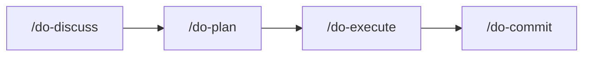
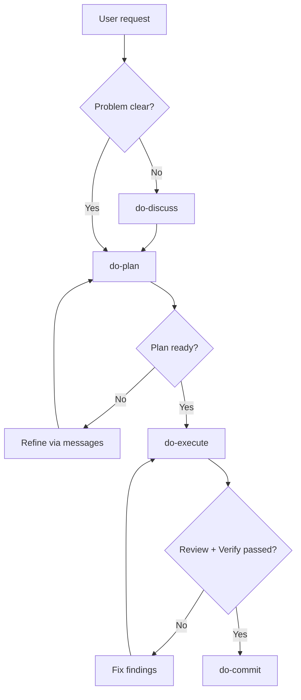

# Spine

> **Same skills, same workflow — every developer, every tool.**

AI coding setup for Cursor, Claude Code, and Codex. One set of skills, agents, and guardrails that works everywhere.

## Contents

- [Quick Start](#quick-start)
- [Workflow](#workflow)
- [Skills and Agents](#skills-and-agents)
- [Tips](#tips)
- [Design Principles](#design-principles)
- [Further Reading](#further-reading)

## Quick Start

> **If it's worth changing, it's worth planning.**

Installs guardrails, skills, agents, hooks, and MCP servers for all detected tools (Cursor, Claude Code, Codex):

```sh
curl -fsSL https://raw.githubusercontent.com/kenoxa/spine/main/install.sh | bash
```

The installer auto-detects which tools you have (`~/.cursor/`, `~/.claude/`, `~/.codex/`) and installs to all of them. For Claude Code, it also installs the [Spine plugin](#claude-code-plugin) (hooks and `use-agent-teams` skill).

<details>
<summary>Inspect before running</summary>

```sh
curl -fsSL https://raw.githubusercontent.com/kenoxa/spine/main/install.sh -o install.sh
less install.sh
bash install.sh
```

</details>

<details>
<summary>Local checkout (recommended for contributors)</summary>

Clone the repo for editing, testing, and iterating on skills before syncing:

```sh
git clone https://github.com/kenoxa/spine.git
cd spine
./install.sh
```

</details>

<details>
<summary>Install individual skills</summary>

Install specific skills without the full setup:

```sh
npx skills add kenoxa/spine -s do-plan -a '*' -g -y
npx skills add kenoxa/spine -s run-review -a '*' -g -y
```

</details>

<details>
<summary>Manual install</summary>

Set up the central directory and reference it from each tool:

```sh
# 1. Copy guardrails and agents to the central directory
mkdir -p ~/.config/spine/agents
cp SPINE.md ~/.config/spine/SPINE.md
touch ~/.config/spine/AGENTS.md   # user customizations (never overwritten)
cp agents/*.md ~/.config/spine/agents/

# 2. Reference from each tool's root file (add your own instructions below the @ lines)
printf '%s\n' '@~/.config/spine/SPINE.md' '@~/.config/spine/AGENTS.md' > ~/.cursor/AGENTS.md
printf '%s\n' '@~/.config/spine/SPINE.md' '@~/.config/spine/AGENTS.md' > ~/.claude/CLAUDE.md
printf '%s\n' '@~/.config/spine/SPINE.md' '@~/.config/spine/AGENTS.md' > ~/.codex/AGENTS.md

# 3. Symlink agents (or copy with: cp ~/.config/spine/agents/*.md ~/.<tool>/agents/)
for agent in ~/.config/spine/agents/*.md; do
  ln -sf "../../.config/spine/agents/$(basename "$agent")" ~/.cursor/agents/
  ln -sf "../../.config/spine/agents/$(basename "$agent")" ~/.claude/agents/
  ln -sf "../../.config/spine/agents/$(basename "$agent")" ~/.codex/agents/
done
```

Skills are installed separately via the `skills` CLI. Public manual examples use `npx skills add` to match [`skills.sh`](https://skills.sh/) (see above); the installer may bootstrap the same CLI through another launcher.

**Claude Code plugin:** Install the Spine plugin for hooks and the `use-agent-teams` skill:

```sh
claude plugin marketplace add kenoxa/spine
claude plugin install spine@kenoxa
```

If your Claude Code CLI doesn't support plugins, install the AGENTS.md hook manually:

```sh
mkdir -p ~/.claude/hooks/
cp claude/hooks/inject-agents-md.sh ~/.claude/hooks/
```

Add to `~/.claude/settings.json`:

```json
{
  "hooks": {
    "SessionStart": [{
      "hooks": [{ "type": "command", "command": "~/.claude/hooks/inject-agents-md.sh" }]
    }]
  }
}
```

**MCP servers:** Configure Context7 and Exa for each tool:

```sh
# Claude Code
claude mcp add --transport http --scope user context7 https://mcp.context7.com/mcp
claude mcp add --transport http --scope user exa "https://mcp.exa.ai/mcp?tools=get_code_context_exa,web_search_exa"

# Codex
codex mcp add context7 --url https://mcp.context7.com/mcp
codex mcp add exa --url "https://mcp.exa.ai/mcp?tools=get_code_context_exa,web_search_exa"
```

For Cursor, add to `~/.cursor/mcp.json`:

```json
{
  "mcpServers": {
    "context7": { "url": "https://mcp.context7.com/mcp" },
    "exa": { "url": "https://mcp.exa.ai/mcp?tools=get_code_context_exa,web_search_exa" }
  }
}
```

For optional API key auth, see the installer source or set `CONTEXT7_API_KEY` / `EXA_API_KEY` in `~/.config/spine/.env`.

</details>

<details>
<summary>CLI tools installed</summary>

The installer checks for these tools and installs missing ones via Homebrew (macOS):

| Tool | Category | Purpose |
|------|----------|---------|
| `git` | Required | Version control |
| `jq` | Required | JSON processing |
| `node` | Required | JavaScript runtime for `skills` tooling and public `npx skills` commands |
| `ast-grep` | Recommended | AST-based structural code search and refactoring |
| `bun` | Recommended | Fast JavaScript runtime and package manager |
| `coreutils` | Recommended | GNU core utilities (macOS) |
| `fd` | Recommended | Fast file finder (alternative to `find`) |
| `ni` | Recommended | Universal JS package manager wrapper (auto-detects pm from lockfile) |
| `ripgrep` | Recommended | Fast text search (alternative to `grep`) |
| `sd` | Recommended | In-place pattern replacement — pairs with `ripgrep` for find+replace flows (Rust-native alternative to `perl -i`/`sed -i`) |
| `shellcheck` | Recommended | Shell script linter |
| `shfmt` | Recommended | Shell script formatter |

On Linux without Homebrew, the installer prints manual install hints.

</details>

<details>
<summary>MCP servers installed</summary>

The installer registers these MCP servers for all detected tools:

| Server | Tools Provided | URL |
|--------|---------------|-----|
| Context7 | `resolve-library-id`, `query-docs` | `https://mcp.context7.com/mcp` |
| Exa | `web_search_exa`, `get_code_context_exa` | `https://mcp.exa.ai/mcp?tools=get_code_context_exa,web_search_exa` |

Both servers work keyless by default. For higher rate limits, set API keys in `~/.config/spine/.env`:

```sh
export CONTEXT7_API_KEY=your-key-here
export EXA_API_KEY=your-key-here
```

The installer reads this file and configures auth headers automatically when keys are present.

</details>

> **Use agent mode.** Spine expects your AI tool to run in its most autonomous
> mode — Cursor agent mode, Claude Code with auto-accept, or Codex auto mode.
> Spine's skills replace built-in plan modes. See [Tips](docs/tips.md#agent-mode)
> for details.

## Workflow

> **Measure twice, ship once.**

Four steps from idea to commit:

1. **[Discuss](docs/skills-reference.md#do-discuss)** (`/do-discuss`) — frame the problem when it's vague or ambiguous
2. **[Plan](docs/skills-reference.md#do-plan)** (`/do-plan`) — draft and validate an implementation plan
3. **[Execute](docs/skills-reference.md#do-execute)** (`/do-execute`) — phased implementation with built-in review and verification
4. **[Commit](docs/skills-reference.md#do-commit)** (`/do-commit`) — stage scoped files and commit with a conventional message

Refine the plan via messages between steps 2 and 3. For straightforward tasks, start directly with `/do-execute` — it handles planning inline when no plan exists.

Skills store intermediate output in `.scratch/` during planning and execution — ephemeral, safe to delete between sessions; during a session the log provides observability. Add `.scratch/` to your `.gitignore`.



<details>
<summary>Detailed flow with loops</summary>



</details>

## Skills and Agents

Skills use prefixes for quick discovery in slash-autocomplete. Type the prefix to filter to the category you need.

### Primary flow (`do-*`)

The core workflow chain — discuss, plan, execute, commit. Each step feeds into the next.

| Skill | Purpose |
|-------|---------|
| [`do-discuss`](docs/skills-reference.md#do-discuss) | Structured problem framing before planning |
| [`do-plan`](docs/skills-reference.md#do-plan) | Structured planning before complex implementation |
| [`do-execute`](docs/skills-reference.md#do-execute) | Execute an approved plan through phased quality gates |
| [`do-commit`](docs/skills-reference.md#do-commit) | Scoped staging with conventional commits |

### Utilities (`run-*`)

Standalone actions you invoke any time — not part of the primary flow.

| Skill | Purpose |
|-------|---------|
| [`run-review`](docs/skills-reference.md#run-review) | Severity-bucketed code review |
| [`run-debug`](docs/skills-reference.md#run-debug) | 4-phase root-cause diagnosis and fix |
| [`run-polish`](docs/skills-reference.md#run-polish) | Advisory code polish with conventions, complexity, and efficiency lenses |
| [`run-insights`](docs/skills-reference.md#run-insights) | Mine cross-tool session history for workflow/setup improvement recommendations (Python 3.9+) |
| [`run-recap`](docs/skills-reference.md#run-recap) | Summarize work done across AI agent sessions for standups, timesheets, and activity reports |

### Domain standards (`with-*`)

Loaded automatically when the task matches their description — no slash command needed.

| Skill | Purpose |
|-------|---------|
| `with-frontend` | UI development with state coverage and accessibility gates |
| `with-backend` | APIs, migrations, and security boundaries |
| `with-js` | JS/TS tooling conventions with ni package management |
| `with-testing` | Risk-based test design with perspective tables |

### Active tools (`use-*`)

Invoked explicitly to produce artifacts or perform discovery.

| Skill | Purpose |
|-------|---------|
| `use-explore` | Bounded codebase navigation and architecture mapping |
| `use-writing` | Docs, changelogs, ADRs, and prose quality |
| `use-skill-craft` | Write, review, or fix skills and AGENTS.md files |

### Session primitives

Workflow helpers invoked by name — no prefix because they're used directly, not discovered by category.

| Skill | Purpose |
|-------|---------|
| [`handoff`](docs/skills-reference.md#handoff) | Distill session context into a structured prompt for a fresh session |
| [`catchup`](docs/skills-reference.md#catchup) | Reconstruct working state after `/clear` or compaction |

See also: [Subagents](docs/skills-reference.md#subagents) · [Prefix convention](docs/skills-reference.md#skill-prefix-convention) · [External skills](docs/global-skills.md)

<details>
<summary>Claude Code plugin</summary>

### Claude Code Plugin

Spine ships a Claude Code plugin with a SessionStart hook (injects `AGENTS.md` into context) and the `use-agent-teams` skill. The [installer](#quick-start) handles setup automatically.

Manual install: `claude plugin marketplace add kenoxa/spine && claude plugin install spine@kenoxa`

See [`claude/README.md`](claude/README.md) for hook details and fallback installation.

</details>

## Tips

See [Tips](docs/tips.md) for slash command usage, workflow advice, model recommendations, and macOS screenshot shortcuts.

## Design Principles

- **Authoring test**: Every skill must address a task an LLM demonstrably handles worse without explicit guidance. No skills for general knowledge.
- **Cross-platform**: No tool-specific formats. Skills, agents, and SPINE.md work in Cursor, Claude Code, and Codex without modification.
- **Progressive disclosure**: SPINE.md is minimal (~85 lines). Skills load on demand. Reference files extract detail from skill bodies.
- **Evidence-based**: Claims in plans, reviews, and execution must be tagged E0–E3. Blocking claims require code evidence (E2+).
- **Self-contained**: No external registry or manifest system. Skills are plain markdown. The installer is a single bash script.

## Further Reading

- [Skills reference](docs/skills-reference.md) — detailed phase descriptions for each workflow skill
- [Tips](docs/tips.md) — workflow tips, model selection, slash command usage
- [External skills reference](docs/global-skills.md) — optional skills from other repos
- [Contributing guide](CONTRIBUTING.md) — authoring skills, subagents, and installer changes
- [Changelog](CHANGELOG.md) — version history and user-facing changes
- [MIT License](LICENSE)
